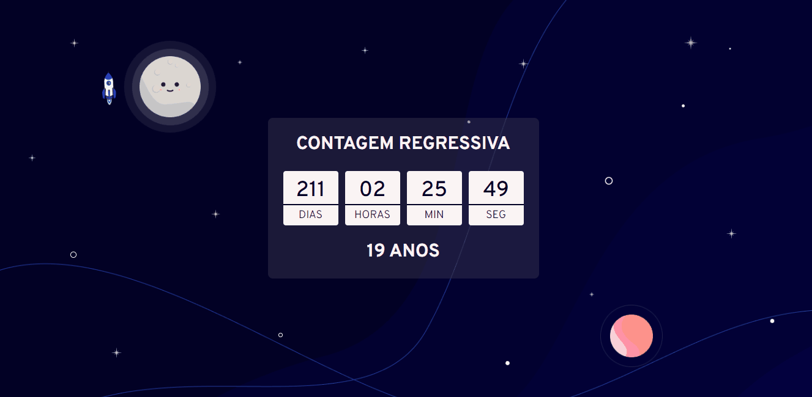

## Teu espaço

Projeto criado especialmente para Bárbara, garota dona do espaço e do mundo, que completa ano a cada 25 de abril e ocupa parte do meu coração.

## Funcionalidades

- Exibe um contador de dias, horas, minutos e segundos até o dia 25 de abril de cada ano.
- Mostra durante o dia 25 de abril uma animação e uma mensagem especial através de uma função que dispara e libera os efeitos quando o contador atinge o horário e dia programado.
- Mostra a idade a ser atingida atualizada após o dia 25 de abril.

## Demonstração

## Tecnologias Utilizadas

- HTML
- CSS
- JavaScript
- Typeit JS
